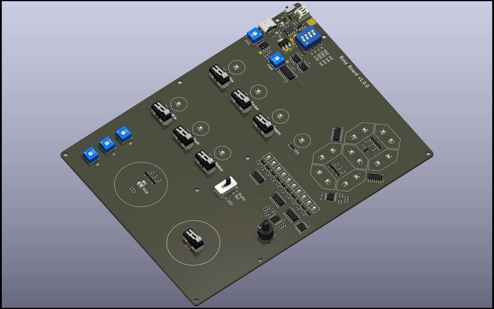
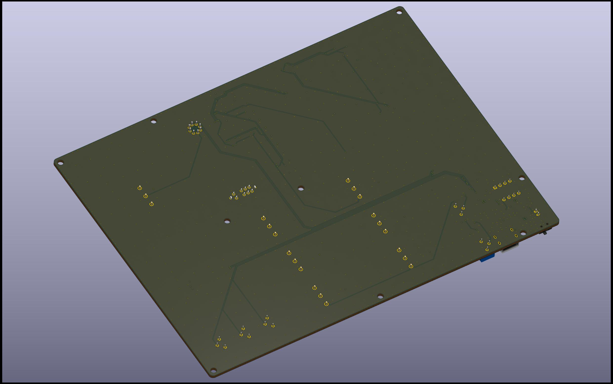

# Busy Board

My son wanted a busy board and I took the challenge to do my own, fully managed
by hardware (no MCU, no software).

Here is a fully hardware managed busy board with buttons & LEDs and an incremental
counter displayed on 7-segments display or LEDs track. Counter increment speed
can be switched with rotary switch from manual (button) to 4 Hz. To avoid buying
coin cells, I added a Lithium battery charger with an USB-C port: charge power
can be set with a DIP switch.

## Hardware

Power:

- USB-C Lipo battery charger (check EEMB 3.7V battery)
- Power switch to completely cut the power supply
- Polarity check
- LED are powered with 3.3V (LDO) or 5V (Boost regulator) from battery

Frequencies (improve battery consumption):

- An RC oscillator generate a 512 Hz frequency
- A binary counter generate multiple sub-frequencies from the 512 Hz
- A saw signal is generate from 128 Hz to generate LED PWM
- PWM duty cycle can be adjusted with potentiometer

Switches:

- 6 push switches that control 6 LEDs: Red, Orange, Green, White, Blue and Purple
- 3 rotary switch to control Red, Green, Blue LED power (change PWM duty cycle)
- Counter selector to switch between: 7-segments, LED track or unique LED
- Rotary switch to select counter speed: Button, 0.5 Hz, 1 Hz, 2 Hz or 4 Hz.

Note: All switches are similar but mechanical part will be 3D printed to provide
multiple type of switches: Push, Rocker, Toggle, Rotary, Key, Wire.

### Manufacturing

The board is manufactured by [JLCPCB](https://jlcpcb.com), here is the details
you will require to generate an order.

*Note: JLCPCB requests some modifications on output files, do not use direct
export from KiCad (check the FAQ)*

#### PCB

Files: [Gerbers](jlcpcb/gerbers.zip)

Configuration              | Value
---------------------------|---------------------------------
Base Materiel              | FR-4
Layers                     | 4
Dimensions                 | 140 x 180 mm
Different design           | 1
Delivery format            | Single PCB
PCB thickness              | 1.0 mm
PCB color                  | Green (other colors have fees)
Silkscreen                 | White
Materiel type              | FR4 TG135
Surface finish             | LeadFree HASL
Specify stackup            | No requirement
Via covering               | Plugged
Min via hole size/diameter | 0.3mm/0.45mm

*Note: All options have not been detail here, keep default value.*

#### Assembly

The project use 54 references with 26 extended. Extended parts bring extra cost
during assembly, around ~3$ per reference (no matter the number of components to
solder). To reduce the cost for small batch I propose two assembly configuration:

- Full: All managed by JLCPCB
- Partial: Basic parts and few extended parts are assembled per JLCPCB, and
  remaining parts can be buy on LCSC and soldered manually.

Files:

- [BOM Full](jlcpcb/bom-full.csv)
- [BOM Partial](jlcpcb/bom-partial.csv) - [BOM Extended](jlcpcb/bom-extended.csv)
- [CPL](jlcpcb/cpl.csv)

Configuration           | Value
------------------------|--------------------
PCBA type               | Economic
Assembly side           | Top
Tooling holes           | Added by JLCPCB
Confirm Parts Placement | Yes

Verify "pick & place" orientations and positions on the web viewer

*Note: All options have not been detail here, keep default value.*

## Mechanical

3D printed parts will be provided in this repository: casing, switches, light guides.
